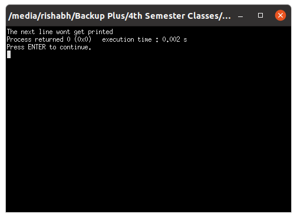
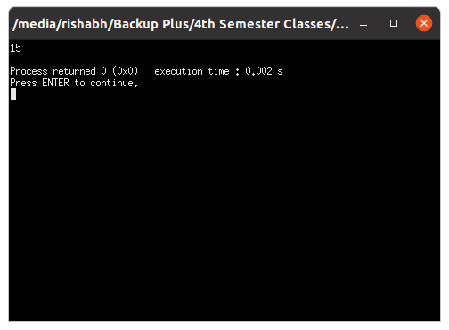
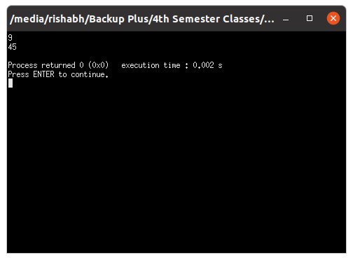

# OOP with C++

## Lab work - 01

#### Lab Date - 18th Jan 2021

#### Name - Rishabh

#### Regno. - 201800631

#### Semester - 4th

---

> ### 1) Write a Hello World Program

 **_Source Code_**

```cpp
#include <iostream>

int main(){

std::cout << "Hello World";
return 0;
}
```

**_Output_**


----


> ### 2) Use of comment

 **_Source Code_**

```cpp
#include <iostream>


int main(){

std::cout << "The next line wont get printed";
//std::cout << "This line wont get printed";
return 0;

}
```

**_Output_**




----


> ### 3) To use namspace std

 **_Source Code_**

```cpp
#include <iostream>

using namespace std;

namespace One
{

    int x = 5;
    void printX(){
        cout<<x<<endl;
    }

}


int main(){

    One::printX();

}
```

**_Output_**


----


> ### 4) To find sum of two numbers

 **_Source Code_**

```cpp
#include <iostream>
using namespace std;

namespace sum{

    int x = 5;
    int y = 10;

    int sum = x + y;

    void printSum(){

        cout<<sum<<endl;

    }
}


int main(){

    sum::printSum();

}

```

**_Output_**




----


> ### 5) Find Minimum and Maxmum of three Nos.

 **_Source Code_**

```cpp
#include <iostream>

using namespace std;

namespace maxMinFinder{

    int a = 10;
    int b = 45;
    int c = 9;
    int min,max;

    void findMin(){

        if(a < b && a < c){
            min = a;
        }

        if(b < a && b < c){
            min = b;
        }
        if(c < a && c < b){
            min = c;
        }

        cout<<min<<endl;

    }
    void findMax(){

        if(a > b && a > c){
            max = a;
        }

        if(b > a && b > c){
            max = b;
        }
        if(c > a && c > b){
            max = c;
        }
        cout<<max<<endl;

    }
}

int main(){

    maxMinFinder::findMin();
    maxMinFinder::findMax();
}

```

**_Output_**


