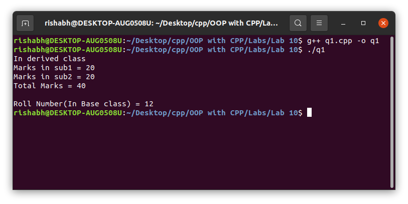
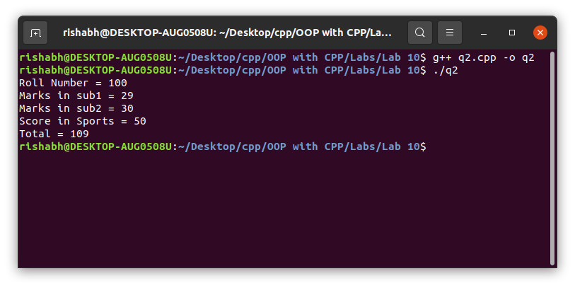

# OOP with C++

## Lab work - 10

#### Lab Date - 5th April 2021

#### Name - Rishabh

#### Regno. - 201800631

#### Semester - 4th

#### GitHub - [https://github.com/rishabh-live/oop-w-cpp-4-sem/tree/main/Labs](https://github.com/rishabh-live/oop-w-cpp-4-sem/tree/main/Labs)

---

> ### 1) C++ program to illustrate function overriding concept in inheritance.

 **_Source Code_**

```cpp
#include <bits/stdc++.h>

using namespace std;
class aclass {
  private:
    int roll;
  public:
    void getroll(int a) {
      roll = a;
    }
  void show(void) {
    cout << "\nRoll Number(In Base class) = " << roll << "\n";
  }
};
class astudent: public aclass {
  int sub1, sub2;
  public:
    void getmarks(int a, int b) {
      sub1 = a;
      sub2 = b;
    }
  void show(void) {
    int total = sub1 + sub2;
    cout << "In derived class\n";
    cout << "Marks in sub1 = " << sub1 << "\n";
    cout << "Marks in sub2 = " << sub2 << "\n";
    cout << "Total Marks = " << total << "\n";
  }
};
int main() {
  astudent obj;
  obj.getroll(12);
  obj.getmarks(20, 20);
  obj.show(); // here the show in der class overrides the base class show fun.
  obj.aclass::show(); // here using :: operator we can invoke the base class show fun.
  return 0;
}
```

**_Output_**



---

> ### 2) C++ program to illustrate the ambiguity resolution using virtual inheritance.
 **_Source Code_**

```cpp
#include <bits/stdc++.h> // use of virtual classes so that no duplicate members are inherited

using namespace std;
class student {
  protected:
    int roll;
  public:
    void getno(int a) {
      roll = a;
    }
  void putno(void) {
    cout << "Roll Number = " << roll << "\n";
  }
};
class test: virtual public student {
  protected: float sub1,
  sub2;
  public: void getmarks(float f1, float f2) {
    sub1 = f1;
    sub2 = f2;
  }
  void putmarks(void) {
    cout << "Marks in sub1 = " << sub1 << "\n";
    cout << "Marks in sub2 = " << sub2 << "\n";
  }
};
class sports: virtual public student {
  protected: float score;
  public: void getscore(float f) {
    score = f;
  }
  void putscore(void) {
    cout << "Score in Sports = " << score << "\n";
  }
};
class result: public test, public sports {
  float total;
  public:
    void display(void) {
      total = sub1 + sub2 + score;
      putno();
      putmarks();
      putscore();
      cout << "Total = " << total << "\n";
    }
};
int main() {
  result r1;
  r1.getno(100);
  r1.getmarks(29, 30);
  r1.getscore(50);
  r1.display();
  return 0;
}
```

**_Output_**


