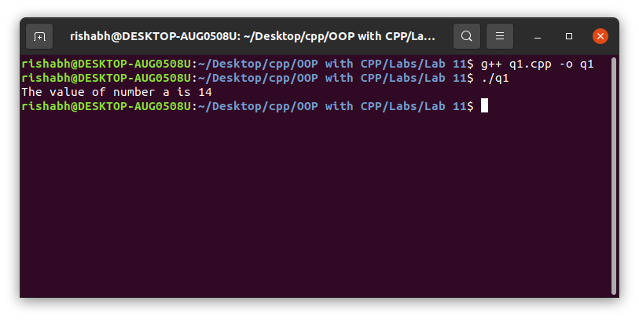
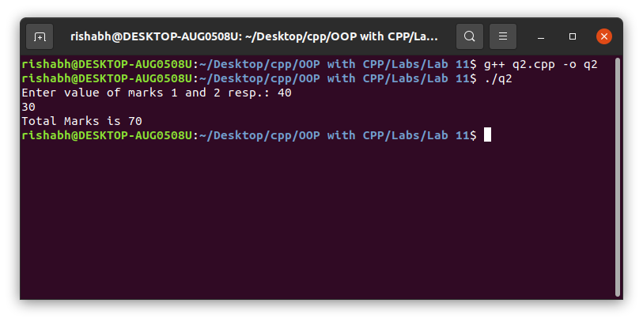
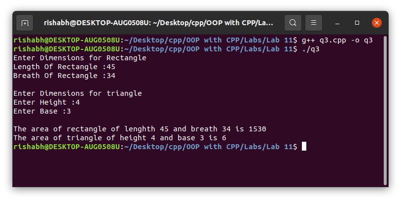
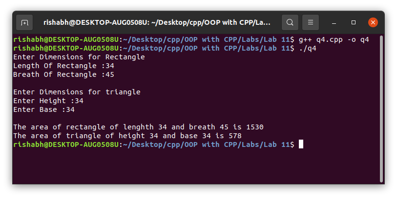

# OOP with C++

## Lab work - 11

#### Lab Date - 15th April 2021

#### Name - Rishabh

#### Regno. - 201800631

#### Semester - 4th

#### GitHub - [https://github.com/rishabh-live/oop-w-cpp-4-sem/tree/main/Labs](https://github.com/rishabh-live/oop-w-cpp-4-sem/tree/main/Labs)

---

> ### 1) When local variable’s name is same as member’s name

 **_Source Code_**

```cpp
#include <bits/stdc++.h>

using namespace std;
class myclass {
  int a;
  public:
    myclass(int a)  // same local variable
  {
    this -> a = a;    // using this pointer assign local to member
  }
  void display(void) {
    cout << "The value of number a is " << a << "\n";
  }
};
int main() {
  myclass obj(14);
  obj.display();
  return 0;
}
```

**_Output_**



---

> ### 2) To return reference to the calling object
 **_Source Code_**

```cpp
// return reference to calling object
#include <bits/stdc++.h>

using namespace std;
class myclass {
  int m1, total;
  public:
    void getdata(int a) {
      m1 = a;
    }
  myclass & totalmarks(myclass & o) {
    o.total = this -> m1 + o.m1;
    return (o);
  }
  void display(void) {
    cout << "Total Marks is " << total << "\n";
  }
};
int main() {
  int a, b;
  cout << "Enter value of marks 1 and 2 resp.: ";
  cin >> a >> b;
  myclass obj1, obj2, obj3;
  obj1.getdata(a);
  obj2.getdata(b);
  obj3 = obj1.totalmarks(obj2);
  obj3.display();
  return 0;
}
```

**_Output_**



> ### 3) 9.1 of E-Balagurusamy Book, through Run-Time Polymorphism.
 **_Source Code_**

```cpp
#include <bits/stdc++.h>

using namespace std;
// program : 9.1 Through Run-Time Poly.
// Uisng Virtual Function
class shape {
  protected:
    double d1, d2;
  public:
    void getdata(int a, int b) {
      d1 = a;
      d2 = b;
    }
  virtual double display_area(void) = 0;
};
class triangle: public shape {
  public: double display_area(void) {
    double area;
    area = 0.5 * d1 * d2;
    return (area);
  }
};
class rectangle: public shape {
  public: double display_area(void) {
    double area;
    area = d1 * d2;    // using pure virtual function
    return (area);
  }
};
int main() {
  double len, bre, hei, base;
  cout << "Enter Dimensions for Rectangle\n";
  cout << "Length Of Rectangle :";
  cin >> len;
  cout << "Breath Of Rectangle :";
  cin >> bre;
  cout << "\nEnter Dimensions for triangle\n";
  cout << "Enter Height :";
  cin >> hei;
  cout << "Enter Base :";
  cin >> base;
  shape * s;
  rectangle r1;
  s = & r1;
  s -> getdata(len, bre);
  cout << "\nThe area of rectangle of lenghth " << len << " and breath " <<
    bre << " is " << s -> display_area() << "\n";
  triangle t1;
  s = & t1;
  s -> getdata(base, hei);
  cout << "The area of triangle of height " << hei << " and base " << base <<
    " is " << s -> display_area() << "\n";
  return 0;
}
```

**_Output_**



---

> ### 4) 9.1 of E-Balagurusamy Book, through Compile-Time Polymorphism.
 **_Source Code_**

```cpp
#include <bits/stdc++.h>

using namespace std;
// program : 9.1 Through Compile-Time Poly.
// Without Using Virtual Function
class shape {
  protected:
    double d1, d2;
  public:
    void getdata(int a, int b) {
      d1 = a;
      d2 = b;
    }
  double display_area(void);
};
class triangle: public shape {
  public: double display_area(void) {
    double area;
    area = 0.5 * d1 * d2;
    return (area);
  }
};
class rectangle: public shape {
  public: double display_area(void) {
    double area;
    area = d1 * d2;
    return (area);
  }
};
int main() {
  double len, bre, hei, base;
  cout << "Enter Dimensions for Rectangle\n";
  cout << "Length Of Rectangle :";
  cin >> len;
  cout << "Breath Of Rectangle :";
  cin >> bre;
  cout << "\nEnter Dimensions for triangle\n";
  cout << "Enter Height :";
  cin >> hei;
  cout << "Enter Base :";
  cin >> base;
  // uisng the class resolution operator
  rectangle r1;
  r1.getdata(len, bre);
  cout << "\nThe area of rectangle of lenghth " << len << " and breath " <<
    bre << " is " << r1.rectangle::display_area() << "\n";
  triangle t1;
  t1.getdata(base, hei);
  cout << "The area of triangle of height " << hei << " and base " << base <<
    " is " << t1.triangle::display_area() << "\n";
  return 0;
}
```

**_Output_**



