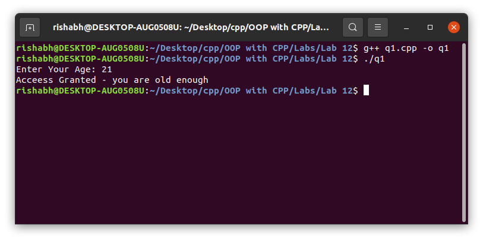

# OOP with C++

## Lab work - 12

#### Lab Date - 22nd April 2021

#### Name - Rishabh

#### Regno. - 201800631

#### Semester - 4th

#### GitHub - [https://github.com/rishabh-live/oop-w-cpp-4-sem/tree/main/Labs](https://github.com/rishabh-live/oop-w-cpp-4-sem/tree/main/Labs)

---

> ### 1) Write a C++ program to use try-catch-through exceptions.

 **_Source Code_**

```cpp
#include <bits/stdc++.h>

using namespace std;
// use of try-catch block for exception handling
int main() {
  int age;
  cout << "Enter Your Age: ";
  cin >> age;
  try {
    if (age >= 18)
      cout << "Acceess Granted - you are old enough\n";
    else
      throw (age);
  } catch (int age1) {
    cout << "Access Denied You are not old enough\n";
    cout << "Your Age: " << age1 << "\n";
  }
  return 0;
}
```

**_Output_**



---

> ### 2) Implement a class template to represent a generic vector to deal with integer and real numbersand use exception cases for unsupportedinputs. Include the member functions to perform the following tasks:To create the vector.To modify the value of a given element.To multiply the vector by ascalar value.To display the vector in the form (10, 20, 30,.....)

 **_Source Code_**

```cpp
#include <iostream>

using namespace std;
template < class T >
  class vector1 {
    T * v;
    int size;
    public:
      void create_vec(int m) // creates null vector
    {
      size = m;
      v = new int[size];
      for (int i = 0; i < size; i++)
        v[i] = 0;
    }
    void create_array(T * a) // creates a vector from array
    {
      for (int i = 0; i < size; i++)
        v[i] = a[i];
    }
    void modify_val(T * arr) {
      char ch;
      cout << "Do You Want to Modify any values ? (Y/N) :";
      cin >> ch;
      if (ch == 'Y') {
        int val, loc;
        cout << "Enter the location to modify and new value :";
        cin >> loc >> val;
        arr[loc] = val;
        display();
      } else {}
    }
    T operator * (vector1 & y)
    // sclar product
    {
      T sum = 0;
      for (int i = 0; i < size; i++) {
        sum += this -> v[i] * y.v[i];
      }
      return (sum);
    }
    void display(void) {
      for (int i = 0; i < size; i++)
        cout << v[i] << ", ";
      cout << "\n";
    }
  };
int main() {
  int size, i;
  cout << "Enter Size Of Vector:";
  try {
    cin >> size;
    if (size % 1 == 0) {
      cout << "Input Condion passed\n";
    } else {
      throw (size);
    }
  } catch (...) {
    cout << "Input Condition Not satisfied\n";
  }
  int x[size], y[size];
  cout << "Enter Elements in vector-1:\n";
  for (i = 0; i < size; i++) {
    cout << "V1[" << i << "] = ";
    cin >> x[i];
  }
  cout << "\n";
  cout << "Enter Elements in vector-2:\n";
  for (i = 0; i < size; i++) {
    cout << "V2[" << i << "] = ";
    cin >> y[i];
  }
  vector1 < int > v1;
  vector1 < int > v2;
  v1.create_vec(size);
  v2.create_vec(size);
  v1.create_array(x);
  v2.create_array(y);
  cout << "Modify For Vector-1\n";
  v1.modify_val(x);
  cout << "Modify For Vector-1\n";
  v2.modify_val(y);
  cout << "V1 = ";
  v1.display();
  cout << "V2 = ";
  v2.display();
  int r = v1.operator * (v2);
  cout << "Result of Sclar Multiplication = " << r;
  return 0;
}
```
**_Output_**


