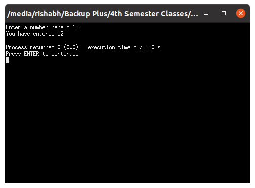
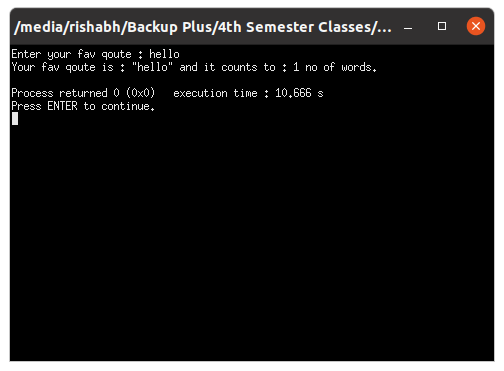
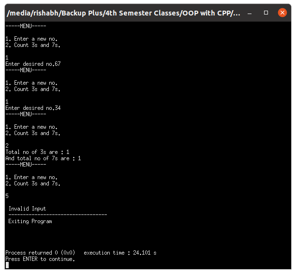
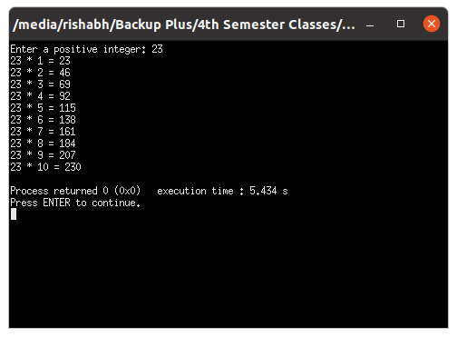
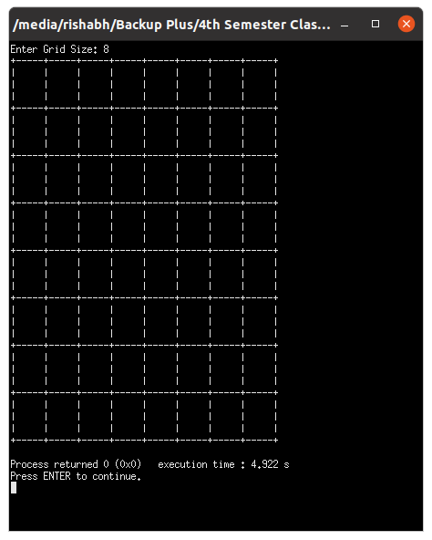

# OOP with C++

## Lab work - 02

#### Lab Date - 25th Jan 2021

#### Name - Rishabh

#### Regno. - 201800631

#### Semester - 4th

#### GitHub - [https://github.com/rishabh-live/oop-w-cpp-4-sem/tree/main/Labs](https://github.com/rishabh-live/oop-w-cpp-4-sem/tree/main/Labs)

---

> ### 1) To use cin and cout

 **_Source Code_**

```cpp
//To use cin and cout

#include <iostream>

using namespace std;

int main(){
    int theInput;
    cout << "Enter a number here : ";
    cin >> theInput;
    cout << "You have entered " << theInput << "\n";

    return 0; 
}
```

**_Output_**



----

> ### 2) To use cin, strings and stringstream

 **_Source Code_**

```cpp
////To use cin , strings and stringstreams

#include <iostream>
#include <bits/stdc++.h>
using namespace std;

int countWords(string str)
{

    stringstream s(str);
    string word;

    int count = 0;
    while (s >> word)
    {
        count++;
    }
    return count;
}

int main()
{

    string theInput;

    cout << "Enter your fav qoute : ";
    cin >> theInput;

    cout << "Your fav qoute is : \"" << theInput << "\"";
    cout << " and it counts to : " << countWords(theInput) << " no of words.\n ";

    return 0;
}
```

**_Output_**



----


> ### 3.a) Read a list of five numbers and counts the number of threes and sevens in the data.

 **_Source Code_**

```cpp
//read a list of five numbers and counts the number of three and sevens in the data

#include <iostream>
#include <sstream>

using namespace std;

int countT(string thNum)
{
    stringstream numStream(thNum);

    int num;
    numStream >> num;

    int ctr = 0;
    int remainder;

    while (num > 0)
    {
        remainder = num % 10;
        num /= 10;

        if (remainder == 3)
            ctr++;
    }

    return ctr;
}

int countS(string thNum)
{
    stringstream numStream(thNum);

    int num;
    numStream >> num;
    int ctr = 0;
    int remainder;

    while (num > 0)
    {
        remainder = num % 10;
        num /= 10;

        if (remainder == 7)
            ctr++;
    }

    return ctr;
}

int main()
{

    string no;
    string input;
    int val = 1;

    while (val == 1 || val == 2)
    {
        cout << "-----MENU-----\n\n1. Enter a new no. \n2. Count 3s and 7s.\n\n";

        cin >> val;

        if (val == 1)
        {
            cout << "Enter desired no.";
            cin >> input;
            no = no + input;
        }
        else if (val == 2)
        {
            cout << "Total no of 3s are : "
                 << countT(no) << "\n"
                 << "And total no of 7s are : "
                 << countS(no) << "\n";
        }
        else
        {
            cout << "\n Invalid Input \n ---------------------------------- \n Exiting Program\n";
        }
    }
    cout << "\n\n\n";
    return 0;
}
```

**_Output_**



----


> ### 3.b) Write a program to print out the multiplication table.

 **_Source Code_**

```cpp
//Write a program to print out the multiplication table.
#include <iostream>
using namespace std;

int main()
{
    int n;

    cout << "Enter a positive integer: ";
    cin >> n;

    for (int i = 1; i <= 10; ++i) {
        cout << n << " * " << i << " = " << n * i << endl;
    }
    
    return 0;
}

```

**_Output_**



----

> ### 3.c) Print a checkerboard (8-by-8 grid). Each square should be 5-by-3 characters wide.

 **_Source Code_**

```cpp
//Print a checkerboard (8-by-8 grid)
#include <iostream>
using namespace std;
int main()
{
	int n;
	cout<<"Enter Grid Size: ";
	cin>>n;
	for(int i=0;i<n;i++)
	{
		for(int j=1;j<=n;j++)
		{
			cout<<"+-----";
		}
		cout<<"+"<<endl;
		for(int j=1;j<=3;j++)
		{
			for(int k=1;k<=n;k++)
			{
				cout<<"|     ";
			}
			cout<<"|"<<endl;
		}
	}
	for(int j=1;j<=n;j++)
		{
			cout<<"+-----";
		}
		cout<<"+"<<endl;
	return 0;
}
```

**_Output_**



----

