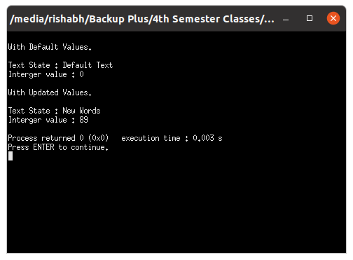
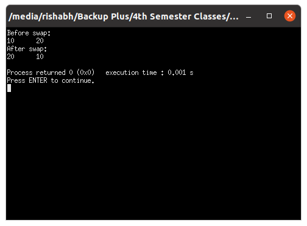
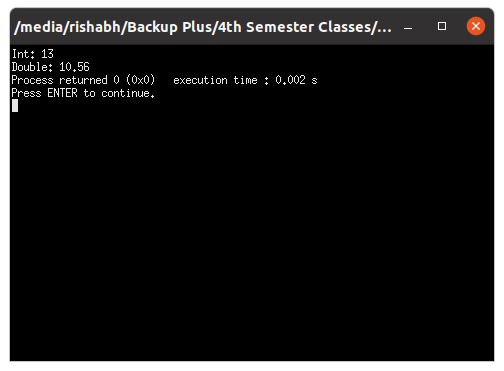

# OOP with C++

## Lab work - 03

#### Lab Date - 01st Feb 2021

#### Name - Rishabh

#### Regno. - 201800631

#### Semester - 4th

#### GitHub - [https://github.com/rishabh-live/oop-w-cpp-4-sem/tree/main/Labs](https://github.com/rishabh-live/oop-w-cpp-4-sem/tree/main/Labs)

---

> ### 1) Write a C++ Program to illustrate function with default arguments

 **_Source Code_**

```cpp
#include <iostream>

using namespace std;

class Illustrate{
    public:
        void ReturnVal(string text = "Default Text", int val = 0 ){
            cout << "\nText State : " << text << "\nInterger value : " << val << "\n";
        }
};


int main(){
    
    Illustrate theObject;

    cout << "\nWith Default Values. \n";
    theObject.ReturnVal(); 
    cout << "\nWith Updated Values. \n";
    theObject.ReturnVal("New Words",89);

    return 0;
}
```

**_Output_**



----

> ### 2) Write a C++ Program to illustrate function with default arguments

 **_Source Code_**

```cpp
#include <iostream>

using namespace std;

class Illustrate{
    public:
        void swapNums(int &x, int &y) {
             int z = x;
             x = y;
             y = z;
}
};


int main(){
    
    Illustrate theObject;

    int firstNum = 10;
    int secondNum = 20;

    cout << "Before swap: " << "\n";
    cout << firstNum <<  "\t" << secondNum << "\n";

    theObject.swapNums(firstNum, secondNum);

    cout << "After swap: " << "\n";
    cout << firstNum <<  "\t" << secondNum << "\n";

    return 0;

    
}
```

**_Output_**



----

> ### 3) Write a C++ Program to Illustrate function overloading

 **_Source Code_**

```cpp
#include <iostream>

using namespace std;

class Illustrate{
    public:
        int plusFunc(int x, int y) {
            return x + y;
        }

        double plusFunc(double x, double y) {
            return x + y;
        }

};


int main(){

    Illustrate theObject;
    int myNum1 = theObject.plusFunc(8, 5);
    double myNum2 = theObject.plusFunc(4.3, 6.26);
    cout << "Int: " << myNum1 << "\n";
    cout << "Double: " << myNum2;


    return 0;
}
```

**_Output_**



----