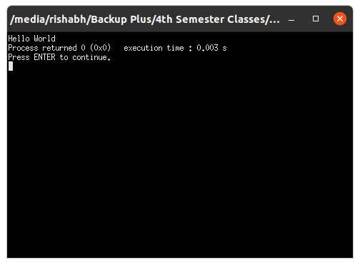

# OOP with C++

## Lab work - 03

#### Lab Date - 01st Feb 2021

#### Name - Rishabh

#### Regno. - 201800631

#### Semester - 4th

---

> ### 1) Write a Hello World Program

 **_Source Code_**

```cpp
#include <iostream>

int main(){

std::cout << "Hello World";
return 0;
}
```

**_Output_**



----