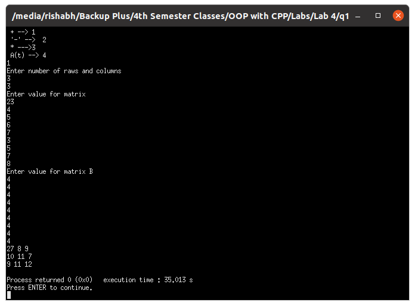
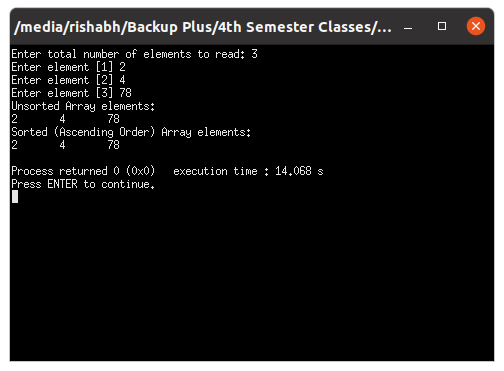
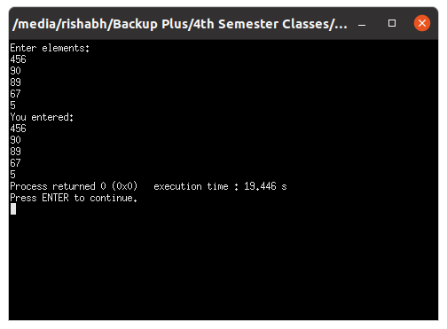
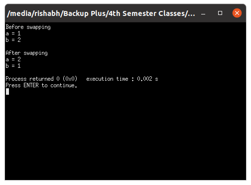
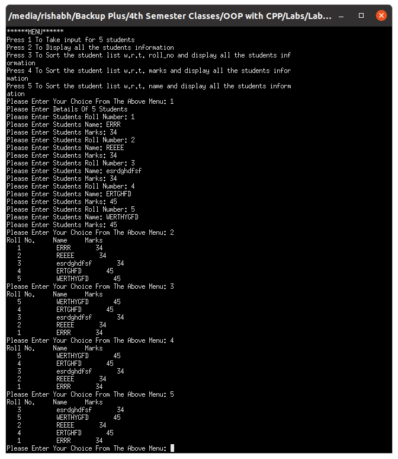

# OOP with C++

## Lab work - 04

#### Lab Date - 08th Feb 2021

#### Name - Rishabh

#### Regno. - 201800631

#### Semester - 4th

#### GitHub - [https://github.com/rishabh-live/oop-w-cpp-4-sem/tree/main/Labs](https://github.com/rishabh-live/oop-w-cpp-4-sem/tree/main/Labs)

---

> ### 1) Write a C++ Program to for matrix operation using switch-case.  (a) add two matrix (b) subtract two matrix (c) multiply two matrix (d) transpose of a matrix

 **_Source Code_**

```cpp
// Write a C++ Program to for matrix operation using
// switch-case.
// (a) add two matrix
// (b) subtract two matrix
// (c) multiply two matrix
// (d) transpose of a matrix

#include<iostream>

    using namespace std;

     int main()
    {
      int m,n;


      int A[10][10],B[10][10],SUM[10][10],Sub[20][20],mlt[20][20],Trans[20][20],choice;

      cout<<"Enter which operation you want to perform \n + --> 1 \n '-' -->  2 \n * --->3 \n A(t) --> 4 \n";
      cin>>choice;
      cout<<"Enter number of raws and columns"<<endl;
      cin>>m>>n;


         cout<<"Enter value for matrix ";
      for (int i=0;i<m;i++)
        for (int j=0;j<n;j++){


            cin>>A[i][j];

        }

        cout<<"Enter value for matrix B \n";
         for (int i=0;i<m;i++)
        for (int j=0;j<n;j++){


            cin>>B[i][j];

        }

      switch(choice){
          case 1 :
                      for (int i=0;i<m;i++)
                           for (int j=0;j<n;j++){
                                    SUM[i][j]= A[i][j]+B[i][j];

                           }
                       for (int i=0;i<m;i++)

                           for (int j=0;j<n;j++)
                           {


                                   cout << SUM[i][j] << " \n"[j == n-1];
                           }

                      break;
          case 2:
                       for (int i=0;i<m;i++)
                           for (int j=0;j<n;j++){
                                    Sub[i][j]= A[i][j]-B[i][j];

                           }
                           for (int i=0;i<m;i++)
                           for (int j=0;j<n;j++){
                                   cout << Sub[i][j] << " \n"[j == n-1];

                           }
                        break;

         case 3:       for (int i=0;i<m;i++)
                           for (int j=0;j<n;j++){
                                    mlt[i][j]= 0;
                           }
                           for (int i=0;i<m;i++)
                           for (int j=0;j<n;j++)
                            for(int k=0;k<m;k++){
                              mlt[i][j]+=A[i][k] * B[k][j];
                           }
                           for (int i=0;i<m;i++)
                           for (int j=0;j<n;j++)
                            {
                                   cout << mlt[i][j] << " \n"[j == n-1];

                           }
                        break;
         case 4:            for (int i=0;i<m;i++)
                           for (int j=0;j<n;j++){
                                    Trans[j][i]= A[i][j];

                           }
                           for (int i=0;i<m;i++)
                           for (int j=0;j<n;j++){
                                   cout<< Trans[i][j] << " \n"[j == n-1];


                           }
                           break;
         default:
            cout<< "Please choose given task only \n";

             }

      return 0; // end the main function

    }
```

**_Output_**



----

> ### 2) Write a C++ Program to Sort the Array in an Ascending Order

 **_Source Code_**

```cpp
// Write a C++ Program to Sort the Array in an
// Ascending Order

#include <iostream>
using namespace std;

#define MAX 100

class ArrayAsse{
    private:
        int arr[MAX];
	    int n,i,j;
	    int temp;
    public:
        int readElements();
        void arrangeArray();

};

int ArrayAsse::readElements(){
    cout<<"Enter total number of elements to read: ";
	cin>>n;
    if(n<0 || n>MAX)
	{
		cout<<"Input valid range!!!"<<endl;
		return -1;
	}
	
	
	for(i=0;i<n;i++)
	{
		cout<<"Enter element ["<<i+1<<"] ";
		cin>>arr[i];
	}
	
	
	cout<<"Unsorted Array elements:"<<endl;
	for(i=0;i<n;i++)
		cout<<arr[i]<<"\t";
	cout<<endl;

    return 0;
}

void ArrayAsse::arrangeArray(){
    for(i=0;i<n;i++)
	{		
		for(j=i+1;j<n;j++)
		{
			if(arr[i]>arr[j])
			{
				temp  =arr[i];
				arr[i]=arr[j];
				arr[j]=temp;
			}
		}
	}
	
	
	cout<<"Sorted (Ascending Order) Array elements:"<<endl;
	for(i=0;i<n;i++)
		cout<<arr[i]<<"\t";
	cout<<endl;
}


int main(){

    ArrayAsse aa;
    aa.readElements();
    aa.arrangeArray();


    return 0;
}
```

**_Output_**



----

> ### 3) Write a C++ Program to print the array index and array element using pointer

 **_Source Code_**

```cpp
// Write a C++ Program to print the array index and
// array element using pointer

#include <iostream>

using namespace std;


class ArrayPointers{
    private:
        int data[5];
    public:
        void enterElements(){
               cout << "Enter elements: " << endl;

                for(int i = 0; i < 5; ++i){
                    cin >> data[i];
                }
      
        }
        void printElements(){
            cout << "You entered: ";
            for(int i = 0; i < 5; ++i){
                cout << endl << *(data + i);
            }
        }
};


int main(){

    ArrayPointers ap;
    ap.enterElements();
    ap.printElements();

    return 0;
}
```
**_Output_**



----

> ### 4) Write a C++ Program to swap two numbers using call by pointer variables

 **_Source Code_**

```cpp
#include<iostream>


using namespace std;

class SwapPointers{
    private:
        int *a, *b, *temp;
    public:
        void takeInputs();
        void swapInputs();

};

void SwapPointers::takeInputs(){
    cout << "Enter value of a and b:";
	cin >> *a >> *b;
}

void SwapPointers::swapInputs(){
    temp = a;
	a = b;
	b = temp;
	cout << "\nAfter swaping\na=" << *a<< "\nb=" << *b << endl;
}

int main() {
    
    SwapPointers sp;

    sp.takeInputs();
    sp.swapInputs();

   

	return 0;
}
```

**_Output_**



----

> ### 5) Create a structure Student with data members name, roll_no & marks. Implement the functions getdata(), showdata() for input and display the details of a student. Using switch-case write a menu driven main function for the following tasks: (a) Take input for 5 students (b) Display all the student’s information in details in tabular form. (c) Sort the student list w.r.t. roll_no and display all in tabular form. (d) Sort the student list w.r.t. marks and display all in tabular form. (e) Sort the student list w.r.t. name and display all in tabular form.

 **_Source Code_**

```cpp
#include<iostream>
using namespace std;

struct student
{
    string name;
    int roll_no;
    int marks;
};
student Students[5];
student temp;

void getdata(student *stud)
{
    cout<<"Please Enter Students Roll Number: ";
    cin>>stud->roll_no;
    cout<<"Please Enter Students Name: ";
    cin>>stud->name;
    cout<<"Please Enter Students Marks: ";
    cin>>stud->marks;
}

void showdata(student stud)
{
    cout<<"   "<<stud.roll_no<<"          "<<""<<stud.name<<"       "<<""<<stud.marks<<"      "<<endl;
}

int main()
{
    int n=6,choice=0;
    cout<<"******MENU******"<<endl;
    cout<<"Press 1 To Take input for 5 students"<<endl;
    cout<<"Press 2 To Display all the students information"<<endl;
    cout<<"Press 3 To Sort the student list w.r.t. roll_no and display all the students information"<<endl;
    cout<<"Press 4 To Sort the student list w.r.t. marks and display all the students information"<<endl;
    cout<<"Press 5 To Sort the student list w.r.t. name and display all the students information"<<endl;
    while(choice<n)
    {
        cout<<"Please Enter Your Choice From The Above Menu: ";
        cin>>choice;
        switch (choice)
        {
        case 1:
            cout<<"Please Enter Details Of 5 Students"<<endl;
            for(int i=0;i<5;i++)
            {
                getdata(&Students[i]);
            }
            break;
        case 2:
            cout<<"Roll No."<<"     "<<"Name"<<"     "<<"Marks"<<"     "<<endl;
            for(int i=0;i<5;i++)
            {
                showdata(Students[i]);
            }
            break;
        case 3:
            for(int i=0;i<5;i++)
            {
                for(int j=i+1;j<5;j++)
                {
                    if(Students[j].roll_no>Students[i].roll_no)
                    {
                        temp.roll_no=Students[i].roll_no;
                        temp.name=Students[i].name;
                        temp.marks=Students[i].marks;
                        Students[i].roll_no=Students[j].roll_no;
                        Students[i].name=Students[j].name;
                        Students[i].marks=Students[j].marks;
                        Students[j].roll_no=temp.roll_no;
                        Students[j].name=temp.name;
                        Students[j].marks=temp.marks;
                    }
                }
            }
            cout<<"Roll No."<<"     "<<"Name"<<"     "<<"Marks"<<"     "<<endl;
            for(int i=0;i<5;i++)
            {
                showdata(Students[i]);
            }
            break;
        case 4:
            for(int i=0;i<5;i++)
            {
                for(int j=i+1;j<5;j++)
                {
                    if(Students[j].marks>Students[i].marks)
                    {
                        temp.roll_no=Students[i].roll_no;
                        temp.name=Students[i].name;
                        temp.marks=Students[i].marks;
                        Students[i].roll_no=Students[j].roll_no;>
                        Students[j].name=temp.name;
                        Students[j].marks=temp.marks;
                    }
                }
            }
            cout<<"Roll No."<<"     "<<"Name"<<"     "<<"Marks"<<"     "<<endl;
            for(int i=0;i<5;i++)
            {
                showdata(Students[i]);
            }
            break;
        case 5:
            for(int i=0;i<5;i++)
            {
                for(int j=i;j<5;j++)
                {
                    if(Students[j].name>Students[i].name)
                    {
                        temp.roll_no=Students[i].roll_no;
                        temp.name=Students[i].name;
                        temp.marks=Students[i].marks;
                        Students[i].roll_no=Students[j].roll_no;
                        Students[i].name=Students[j].name;
                        Students[i].marks=Students[j].marks;
                        Students[j].roll_no=temp.roll_no;
                        Students[j].name=temp.name;
                        Students[j].marks=temp.marks;
                    }
                }
            }
            cout<<"Roll No."<<"     "<<"Name"<<"     "<<"Marks"<<"     "<<endl;
            for(int i=0;i<5;i++)
            {
                showdata(Students[i]);
            }
            break;
        default:
            cout<<"Wrong Choice"<<endl;
            cout<<"Exiting......"<<endl;
            break;
        }
    }
    return 0;
}
```

**_Output_**



----