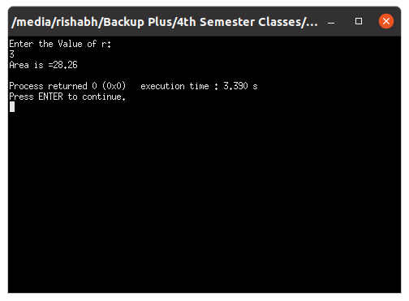
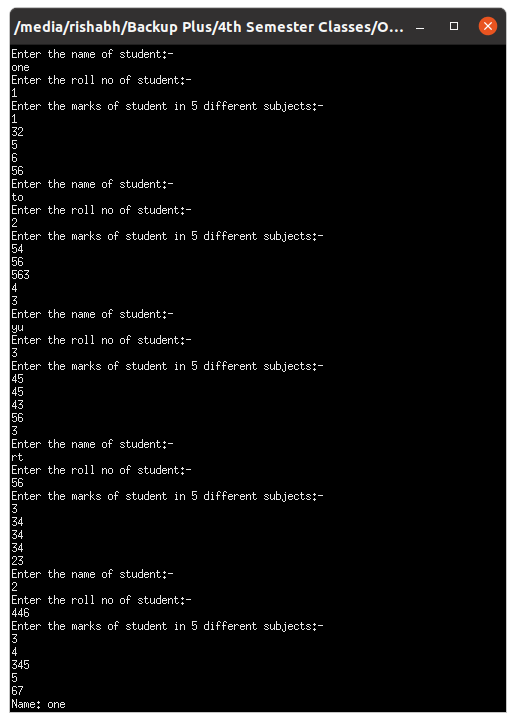
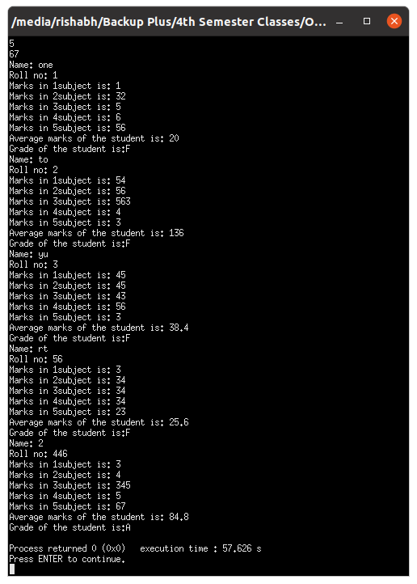
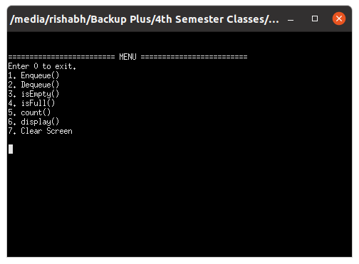

# OOP with C++

## Lab work - 05

#### Lab Date - 15th Feb 2021

#### Name - Rishabh

#### Regno. - 201800631

#### Semester - 4th

#### GitHub - [https://github.com/rishabh-live/oop-w-cpp-4-sem/tree/main/Labs](https://github.com/rishabh-live/oop-w-cpp-4-sem/tree/main/Labs)

---

> ### 1) Class with member variable and member functions

 **_Source Code_**

```cpp
#include<bits/stdc++.h>
using namespace std;
class circle{
    private :
     float r;
    public:
     void getdata();
     void area();
};
void circle::getdata(){
     cout<<"Enter the Value of r:"<<endl;
     cin>>r;
}
void circle::area(){
     float a;
     a=3.14*r*r;
     cout<<"Area is ="<<a<<endl;
}
int main(){
    circle c1,c2;
    c1.getdata();
    c1.area();
    return 0;
}
```

**_Output_**



----

> ### 2) Create a Class Student with data members name, roll_no and marks of 5 subjects with member functions getdata() which will take input, average() which will calculate average, grade() which will calculate grade and display() which will display name, roll_no, grade of the student. (a) Take input for 5 students (b) Display all the student’s information in details in tabular form. 

 **_Source Code_**

```cpp
#include <bits/stdc++.h>
using namespace std;
class student_record
{
    string name;
    int roll_no;
    float marks[5];

public:
    void getdata()
    {
        cout << "Enter the name of student:-"
             << "\n";
        getline(cin, name);
        cout << "Enter the roll no of student:- "
             << "\n";
        cin >> roll_no;
        cout << "Enter the marks of student in 5 different subjects:-"
             << "\n";
        for (int i = 0; i < 5; i++)
        {
            cin >> marks[i];
        }
    }
    double average()
    {
        float sum = 0;
        for (int x = 0; x < 5; x++)
        {
            sum += marks[x];
        }
        return sum / 5;
    }
    void display()
    {
        cout << "Name: " << name << "\n"
             << "Roll no: " << roll_no << "\n";
        for (int x = 0; x < 5; x++)
        {
            cout << "Marks in " << x + 1 << "subject is: " << marks[x] << "\n";
        }
    }
    void Grade()
    {
        double avg = average();
        if (avg <= 100 && avg >= 90)
        {
            cout << "S";
        }
        else if (avg <= 89 && avg >= 80)
        {
            cout << "A";
        }
        else if (avg <= 79 && avg >= 70)
        {
            cout << "B";
        }
        else if (avg <= 69 && avg >= 60)
        {
            cout << "C";
        }
        else if (avg <= 59 && avg >= 50)
        {
            cout << "D";
        }
        else if (avg <= 49 && avg >= 40)
        {
            cout << "E";
        }
        else
        {
            cout << "F";
        }
    }
};
int main()
{
    student_record R[5];
    for (int i = 0; i < 5; i++)
    {
        R[i].getdata();
        cin.ignore();
    }
    for (int i = 0; i < 5; i++)
    {
        R[i].display();
        cout << "Average marks of the student is: " << R[i].average() << "\n";
        cout << "Grade of the student is:";
        R[i].Grade();
        cout << "\n";
    }
    return 0;
}

```

**_Output_**

 

----

> ### 3) Write a class to implement a simple queue. A queue is very similar to a stackexcept the data is removed in first-in-first-out (FIFO) order. 

 **_Source Code_**

```cpp
#include <bits/stdc++.h>
using namespace std;
class Queue
{
private:
    int front;
    int rear;
    int arr[5];

public:
    Queue()
    {
        front = -1;
        rear = -1;
        for (int i = 0; i < 5; i++)
        {
            arr[i] = 0;
        }
    }
    bool isEmpty()
    {
        if (front == -1 && rear == -1)
            return true;
        else
            return false;
    }
    bool isFull()
    {
        if (rear == 4)
            return true;
        else
            return false;
    }
    void enqueue(int val)
    {
        if (isFull())
        {
            cout << "Queue full"
                 << "\n";
            return;
        }
        else if (isEmpty())
        {
            rear = 0;
            front = 0;
            arr[rear] = val;
        }
        else
        {
            rear++;
            arr[rear] = val;
        }
    }
    int dequeue()
    {
        int x = 0;
        if (isEmpty())
        {
            cout << "Queue is Empty"
                 << "\n";
            return x;
        }
        else if (rear == front)
        {
            x = arr[rear];
            rear = -1;
            front = -1;
            return x;
        }
        else
        {
            cout << "front value: " << front << "\n";
            x = arr[front];
            arr[front] = 0;
            front++;
            return x;
        }
    }
    int count()
    {
        return (rear - front + 1);
    }
    void display()
    {
        cout << "All values in the Queue are - "
             << "\n";
        for (int i = 0; i < 5; i++)
        {
            cout << arr[i] << " ";
        }
    }
};
int main()
{
    Queue q1;
    int value, option;
    cout << "\n"
         << "\n"
         << "========================= MENU ========================="
         << "\n";
    cout << "Enter 0 to exit."
         << "\n";
    cout << "1. Enqueue()"
         << "\n";
    cout << "2. Dequeue()"
         << "\n";
    cout << "3. isEmpty()"
         << "\n";
    cout << "4. isFull()"
         << "\n";
    cout << "5. count()"
         << "\n";
    cout << "6. display()"
         << "\n";
    cout << "7. Clear Screen"
         << "\n"
         << "\n";
    do
    {
        cin >> option;
        switch (option)
        {
            case 0:
                break;
            case 1:
                cout << "Enqueue Operation \nEnter an item to Enqueue in the Queue"
                     << "\n";
                cin >> value;
                q1.enqueue(value);
                break;
            case 2:
                cout << "Dequeue Operation \nDequeued Value : " << q1.dequeue() << "\n";
                break;
            case 3:
                if (q1.isEmpty())
                    cout << "Queue is Empty"
                         << "\n";
                else
                    cout << "Queue is not Empty"
                         << "\n";
                break;
            case 4:
                if (q1.isFull())
                    cout << "Queue is Full"
                         << "\n";
                else
                    cout << "Queue is not Full"
                         << "\n";
                break;
            case 5:
                cout << "Count Operation \nCount of items in Queue : " << q1.count() << "\n";
                break;
            case 6:
                cout << "Display Function Called - "
                     << "\n";
                q1.display();
                break;
            case 7:
                system("cls");
                break;
            default:
                cout << "Enter Proper Option number "
                     << "\n";
        }
    } while (option != 0);
    return 0;
}
```

**_Output_**



----