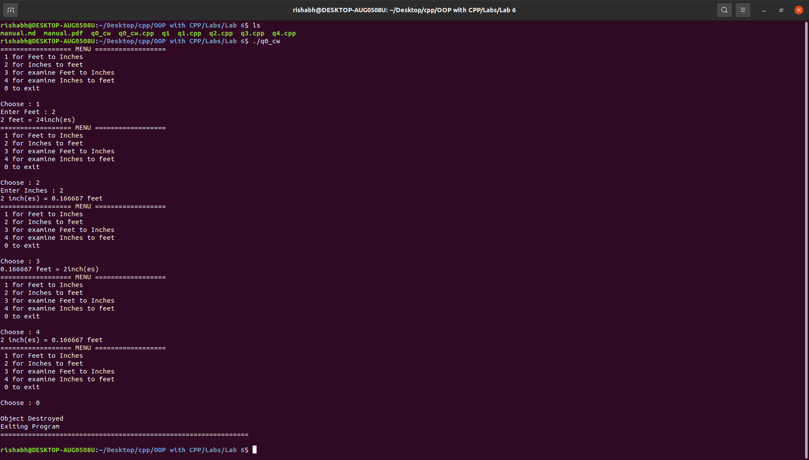
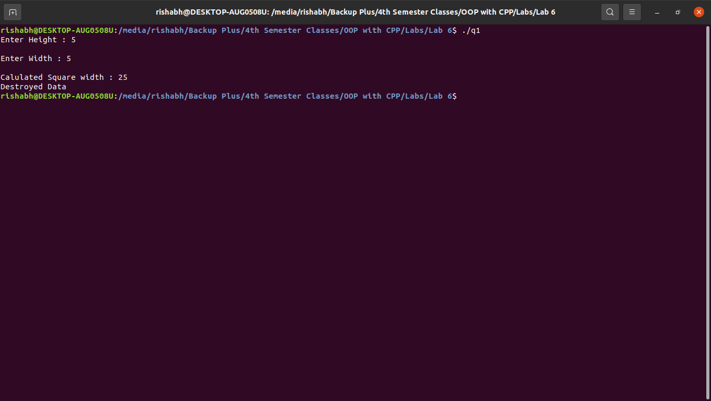
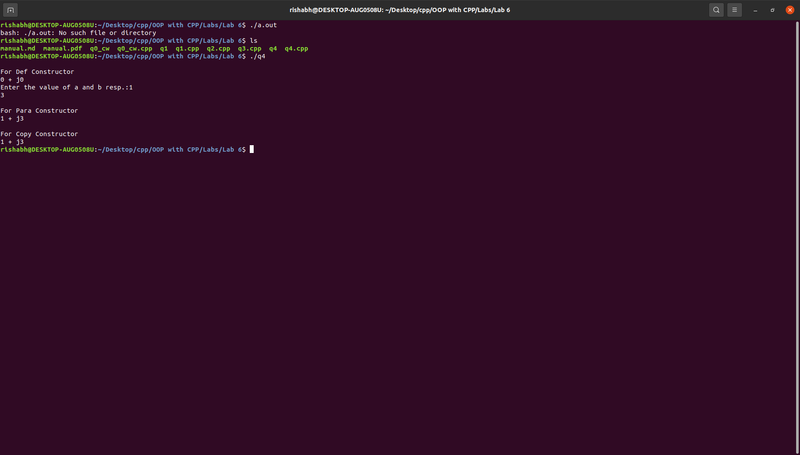

# OOP with C++

## Lab work - 06

#### Lab Date - 22th Feb 2021

#### Name - Rishabh

#### Regno. - 201800631

#### Semester - 6th

#### GitHub - [https://github.com/rishabh-live/oop-w-cpp-4-sem/tree/main/Labs](https://github.com/rishabh-live/oop-w-cpp-4-sem/tree/main/Labs)

---

> ### 1) Create a class called distance that has a separate integer member data for feet and inches. One constructor should initialize this data to zero and another should initialize it to fixed values. A member function should display it in feet inches format.

 **_Source Code_**

```cpp
#include <iostream>

using namespace std;


class theDistance{
    private:
        float feet, inches;
        int option;

    public:

        theDistance(){
            feet = 0;
            inches = 0;
        }
        ~theDistance(){
            cout << "Object Destroyed \nExiting Program \n===============================================================\n" << endl;
        }

        void convertToFeet(){
            cout << "Enter Inches : ";
            cin >> inches;
            feet = inches/12; 
            cout << inches << " inch(es) = " << feet << " feet";
        }
        void convertToFeet(float inpuInches){
            inpuInches =  inches;
            feet = inches/12; 
            cout << inches << " inch(es) = " << feet << " feet";
        }


        void convertToInch(){
            cout << "Enter Feet : ";
            cin >> feet;
            inches = feet * 12; 
            cout << feet << " feet = " << inches << "inch(es)";
        }
        void convertToInch(float inpuInches){
            inpuInches =  feet;
            inches = feet * 12;
            cout << feet << " feet = " << inches << "inch(es)";
        }
        void menu(){
            cout << "================== MENU ==================";
            cout << "\n 1 for Feet to Inches \n 2 for Inches to feet \n 3 for examine Feet to Inches \n 4 for examine Inches to feet \n 0 to exit \n\n";
        }

        int ask(){
            cout << "Choose : ";
            cin >> option;
            return option;
        }

        

};


int main(){

    theDistance obj;
    int x = 99;
    while(x != 0){

        obj.menu();
        x = obj.ask();

        if(x == 1){
            obj.convertToInch();
        }

        if(x == 2){
            obj.convertToFeet();
        }

        if(x == 3){
            obj.convertToInch(1);
        }

        if(x == 4){
            obj.convertToFeet(1);
        }

        cout << "\n";

        
    }
    return 0;

}
```

**_Output_**



----
### 2) Write a program to use constructors, destructor and function overloading

 **_Source Code_**

```cpp
#include <bits/stdc++.h>
using namespace std;
// use of copy constructor
class myclass
{
    int a, b;

public:
    myclass(int m, int n)
    {
        a = m;
        b = n;
        cout << "Inside Parametarized Constructor\n";
        cout << "a = " << a << " b = " << b;
    }
    myclass(myclass& i)
    {
        a = i.a;
        b = i.b;
        cout << "\nInside copy Constructor, values are copied\n";
        cout << "a = " << a << " b = " << b;
    }
};
int main()
{
    myclass c1(10, 20), c2(c1);
    return 0;
}
```
**_Output_**



----
### 3) Write a C++ program(display a complex number in the form of a+ib, where 'a' is the real part and 'b' is the imaginary part.) to get the default value by default constructor, user input value by the parameterized constructor and to get the value from other existing object using copy constructor.

 **_Source Code_**

```cpp
#include <bits/stdc++.h>
using namespace std;
class mycomplex
{
    float a, b;

public:
    mycomplex()
    {
        a = 0;
        b = 0;
    } // def constructor
    mycomplex(float c, float d) // para constructor
    {
        a = c;
        b = d;
    }
    mycomplex(mycomplex& c) // copy constructor
    {
        a = c.a;
        b = c.b;
    }
    void display(void) // display member function
    {
        cout << a << " + "
             << "j" << b << "\n";
    }
    ~mycomplex(){}// destructor
    
};
int main()
{
    
    float c,d;
    mycomplex c1;
    cout << "\nFor Def Constructor\n";
    c1.display();
    cout << "Enter the value of a and b resp.:";
    cin >> c >> d;
    mycomplex c2(c, d);
    cout << "\nFor Para Constructor\n";
    c2.display();
    mycomplex c3(c2);
    cout << "\nFor Copy Constructor\n";
    c3.display();
    return 0;
}
```
**_Output_**

