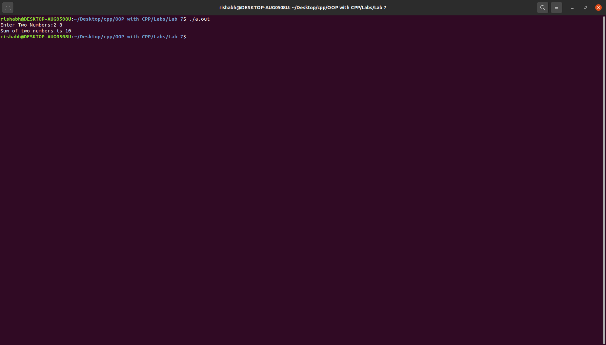

# OOP with C++

## Lab work - 07

#### Lab Date - 14th March 2021

#### Name - Rishabh

#### Regno. - 201800631

#### Semester - 4th

#### GitHub - [https://github.com/rishabh-live/oop-w-cpp-4-sem/tree/main/Labs](https://github.com/rishabh-live/oop-w-cpp-4-sem/tree/main/Labs)

---

> ### 1) Write a program to use friend function to access private member of an object.

 **_Source Code_**

```cpp
// to use friend function to access private members of a class through objects
#include <bits/stdc++.h>

using namespace std;
class myclass {
  int a, b;
  public:
    void getdata(int c, int d) {
      a = c;
      b = d;
    }
  friend void display_sum(myclass obj1) {
    int sum;
    sum = obj1.a + obj1.b;
    cout << "Sum of two numbers is " << sum << "\n";
  }
};
int main() {
  int c, d;
  cout << "Enter Two Numbers:";
  cin >> c >> d;
  myclass obj;
  obj.getdata(c, d);
  display_sum(obj);
  return 0;
}
```

**_Output_**


