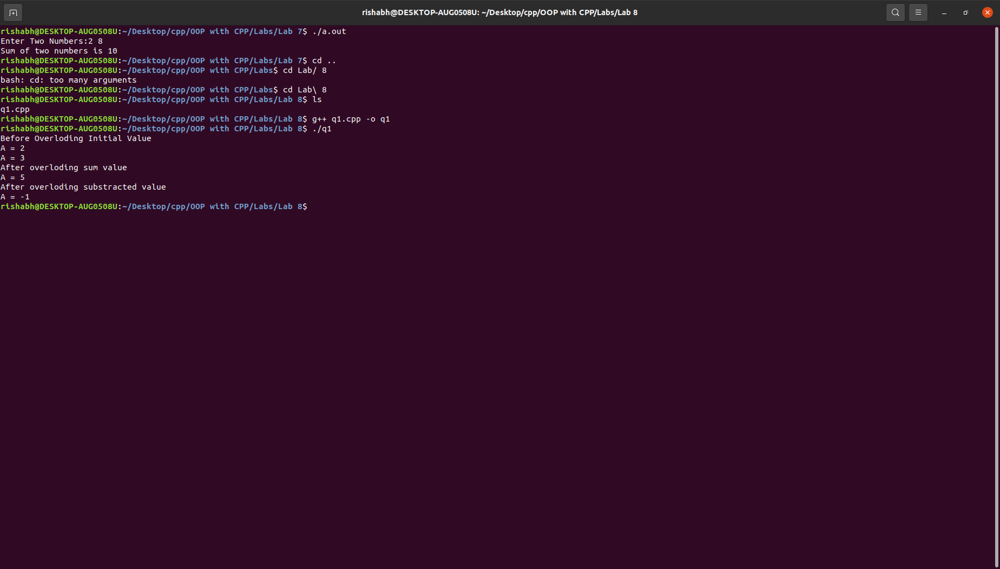
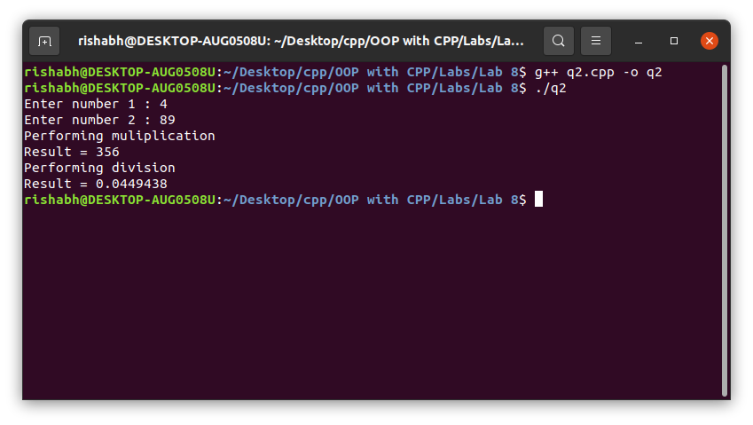
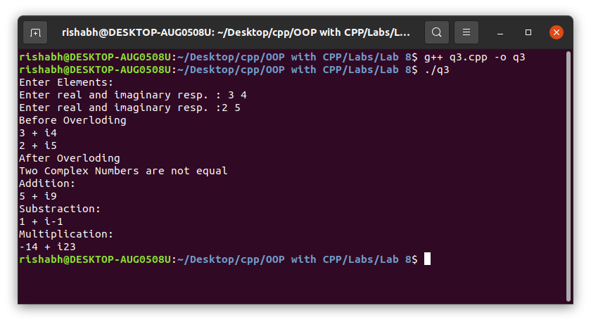

# OOP with C++

## Lab work - 08

#### Lab Date - 20th March 2021

#### Name - Rishabh

#### Regno. - 201800631

#### Semester - 4th

#### GitHub - [https://github.com/rishabh-live/oop-w-cpp-4-sem/tree/main/Labs](https://github.com/rishabh-live/oop-w-cpp-4-sem/tree/main/Labs)

---

> ### 1) Write a program to overload + and - operators using member functions.

 **_Source Code_**

```cpp
// using member function
#include <bits/stdc++.h>

using namespace std;
class myclass {
  int a;
  public:
    void getdata(int x) {
      a = x;
    }
  myclass operator - (myclass o) {
    myclass temp;
    temp.a = a - o.a;
    return (temp);
  }
  myclass operator + (myclass o1) {
    myclass temp;
    temp.a = a + o1.a;
    return (temp);
  }
  void display(void) {
    cout << "A = " << a << "\n";
  }
};
int main() {
  myclass obj, obj1, obj2;
  obj.getdata(2);
  obj1.getdata(3);
  cout << "Before Overloding Initial Value\n";
  obj.display();
  obj1.display();
  obj2 = obj.operator + (obj1); // or obj2 = obj + obj1;
  cout << "After overloding sum value\n";
  obj2.display();
  obj2 = obj.operator - (obj1); // or obj2 = obj - obj1;
  cout << "After overloding substracted value\n";
  obj2.display();
  return 0;
}
```

**_Output_**



---

> ### 2) Write a program Write a program to overload * and / operators using friend functions.

 **_Source Code_**

```cpp
// using friend function
#include <bits/stdc++.h>

using namespace std;
int i = 1;
class myclass {
  float a;
  public:
    void getdata(void) {
      cout << "Enter number " << i << " : ";
      cin >> a;
      i++;
    }
  friend myclass operator / (myclass a, myclass b) {
    myclass temp;
    temp.a = a.a / b.a;
    return (temp);
  }
  friend myclass operator * (myclass a, myclass b) {
    myclass temp;
    temp.a = a.a * b.a;
    return (temp);
  }
  void display(void) {
    cout << "Result = " << a << "\n";
  }
};
int main() {
  myclass c1, c2, c3;
  c1.getdata();
  c2.getdata();
  cout << "Performing muliplication\n";
  c3 = c1 * c2;
  c3.display();
  cout << "Performing division\n";
  c3 = c1 / c2;
  c3.display();
  return 0;
}
```

**_Output_**



--- 
> ### 3) Create a class 'COMPLEX' to hold a complex number. Write a friend function to add, subtract and multiply two complex numbers. Also implement the following operator overloading functions for COMPLEX numbers. (a) >> operator to take input of a complex number (b) << operator to display a complex number in the form of a+ib (c) + operator to add two complex number. – operator to subtract one from other complex number – operator to multiply two complex number (d) == to compare two complex number.

 **_Source Code_**

```cpp
#include <bits/stdc++.h>

using namespace std;
class complex1 {
  float x, y;
  public:
    friend void operator == (complex1 o, complex1 o1) // to compare
  {
    if ((o.x == o1.x) && (o.y == o1.y))
      cout << "Two Complex Numbers are equal\n";
    else
      cout << "Two Complex Numbers are not equal\n";
  }
  friend complex1 operator + (complex1 o, complex1 o1) // to add
  {
    complex1 temp;
    temp.x = o.x + o1.x;
    temp.y = o.y + o1.y;
    return (temp);
  }
  friend complex1 operator - (complex1 o, complex1 o1) // to substract
  {
    complex1 temp1;
    temp1.x = o.x - o1.x;
    temp1.y = o.y - o1.y;
    return (temp1);
  }
  friend complex1 operator * (complex1 o, complex1 o1) // to multiply
  {
    float prod1, prod2, prod3;
    complex1 temp1;
    prod1 = o.x * o1.x;
    prod2 = o.y * o1.y;
    prod3 = (o.x + o.y) * (o1.x + o1.y);
    temp1.x = prod1 - prod2;
    temp1.y = prod3 - (prod1 + prod2);
    return (temp1);
  }
  // overloding >> , << operators
  friend istream & operator >> (istream & din, complex1 & v) // to take input
  {
    cout << "Enter real and imaginary resp. :";
    din >> v.x >> v.y;
    return (din);
  }
  friend ostream & operator << (ostream & dout, complex1 & v1) // to display output
  {
    dout << v1.x << " + i" << v1.y << "\n";
    return (dout);
  }
};
int main() {
  complex1 c1, c2, c3, c4, c5; // objects declaration
  cout << "Enter Elements:\n"; // input overloding
  cin >> c1;
  cin >> c2;
  cout << "Before Overloding\n"; // output overloding
  cout << c1;
  cout << c2;
  cout << "After Overloding\n";
  c1 == c2;
  // == operator overloding
  cout << "Addition:\n"; // + operator overloding
  c3 = c1 + c2;
  cout << c3;
  // << operator overloding
  cout << "Substraction:\n"; // - operator overloding
  c4 = c1 - c2;
  cout << c4;
  // << operator overloding
  cout << "Multiplication:\n"; // * operator overloding
  c5 = c1 * c2;
  cout << c5;
  // << operator overloding
  return 0;
}
```

**_Output_**


