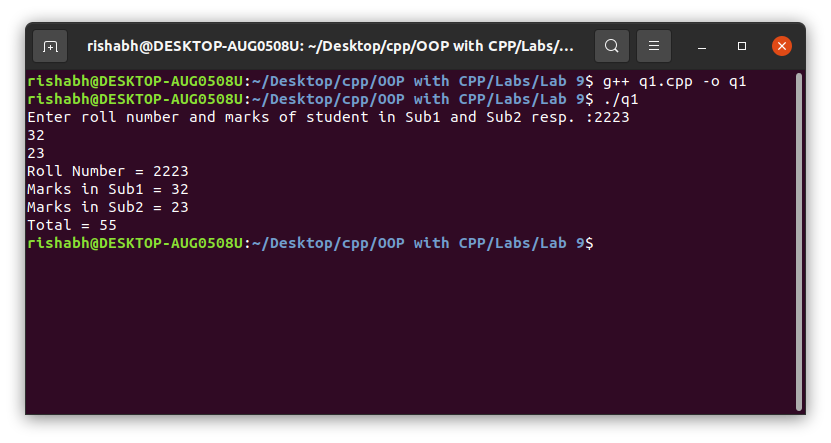
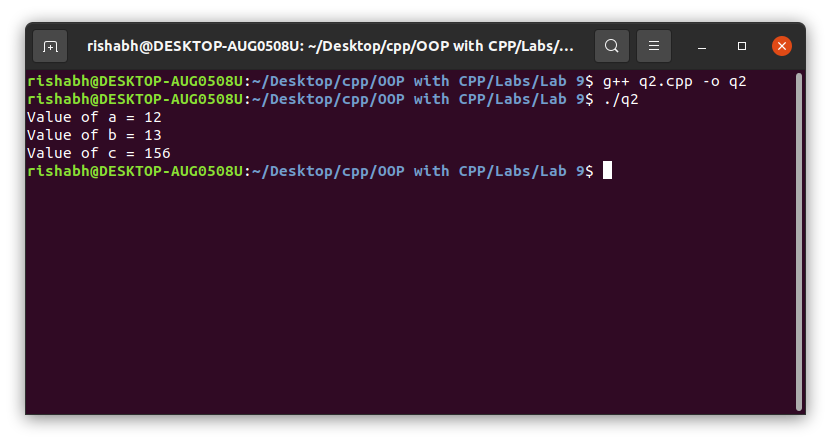

# OOP with C++

## Lab work - 09

#### Lab Date - 26th March 2021

#### Name - Rishabh

#### Regno. - 201800631

#### Semester - 4th

#### GitHub - [https://github.com/rishabh-live/oop-w-cpp-4-sem/tree/main/Labs](https://github.com/rishabh-live/oop-w-cpp-4-sem/tree/main/Labs)

---

> ### 1) Write a program to implement multilevel inheritance.

 **_Source Code_**

```cpp
// Multilevel Inheritance
#include <bits/stdc++.h>

using namespace std;
class student {
  protected:
    int roll_no;
  void put_no(void) {
    cout << "Roll Number = " << roll_no << "\n";
  }
  public:
    void get_no(int a) {
      roll_no = a;
    }
};
class test: public student // protected becomes protected and public becomes public
{
  protected: float sub1;
  float sub2;
  void put_marks(void) {
    cout << "Marks in Sub1 = " << sub1 << "\n";
    cout << "Marks in Sub2 = " << sub2 << "\n";
  }
  public: void get_marks(float a, float b) {
    sub1 = a;
    sub2 = b;
  }
};
class result: public test {
  float total;
  public:
    void display(void) {
      total = sub1 + sub2;
      put_no();
      put_marks();
      cout << "Total = " << total << "\n";
    }
};
int main() {
  int r;
  float e, d;
  cout << "Enter roll number and marks of student in Sub1 and Sub2 resp. :";
  cin >> r >> e >> d;
  result student1;
  student1.get_no(r);
  student1.get_marks(e, d);
  student1.display();
  return 0;
}
```

**_Output_**



---

> ### 2) Write a program to implement multiple inheritance.
 **_Source Code_**

```cpp
// Multiple inheritance
#include <bits/stdc++.h>

using namespace std;
class base_1 {
  protected:
    int a;
  public:
    void getadata(int);
};
class base_2 {
  protected:
    int b;
  public:
    void getadata1(int);
};
class der: public base_1, public base_2 {
  int c;
  int mul(void);
  public:
    void display(void);
};
void base_1::getadata(int a1) {
  a = a1;
}
void base_2::getadata1(int b1) {
  b = b1;
}
int der::mul(void) {
  c = a * b;
  return (c);
}
void der::display(void) {
  cout << "Value of a = " << a << "\n";
  cout << "Value of b = " << b << "\n";
  cout << "Value of c = " << mul() << "\n";
}
int main() {
  der obj;
  obj.getadata(12);
  obj.getadata1(13);
  obj.display();
  return 0;
}
```

**_Output_**


